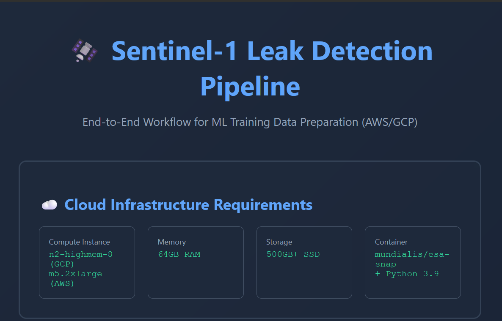
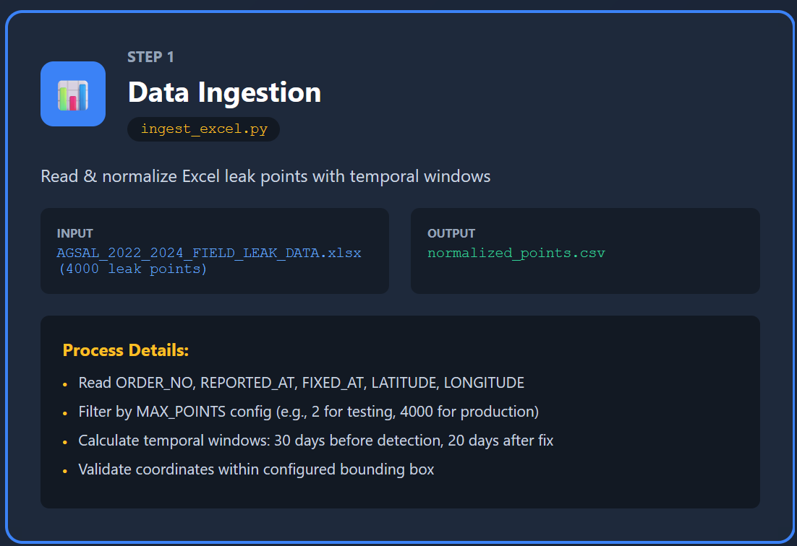
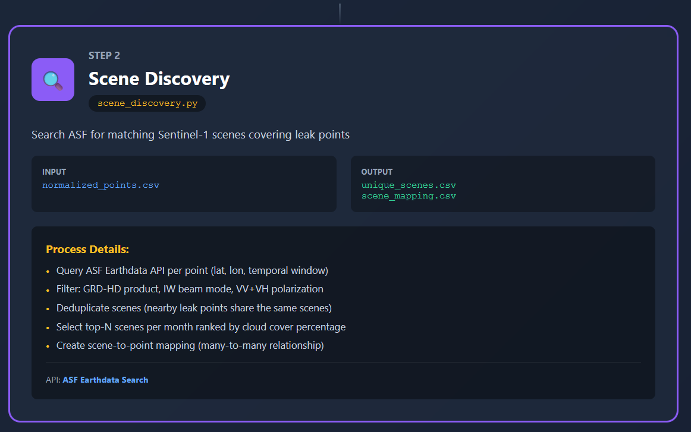
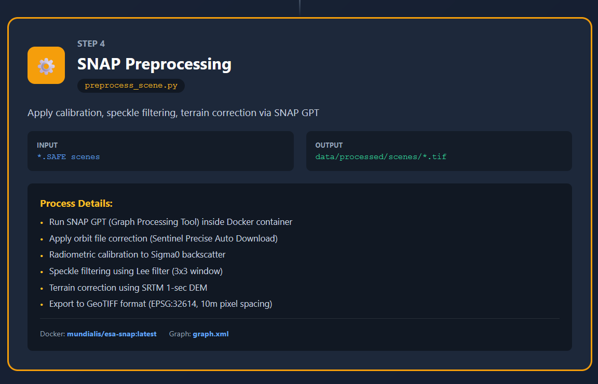
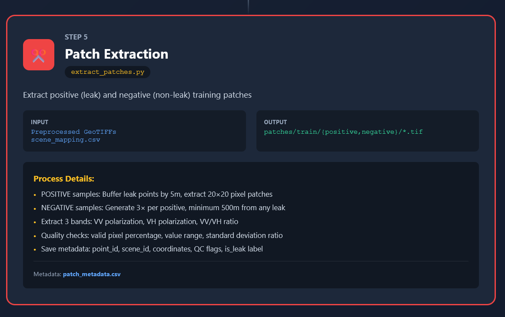
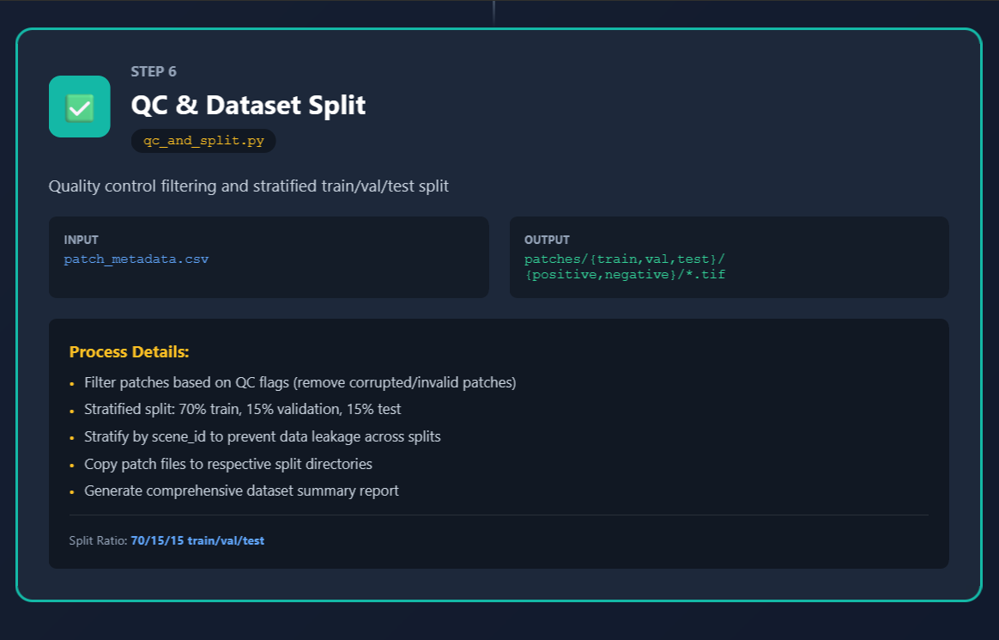
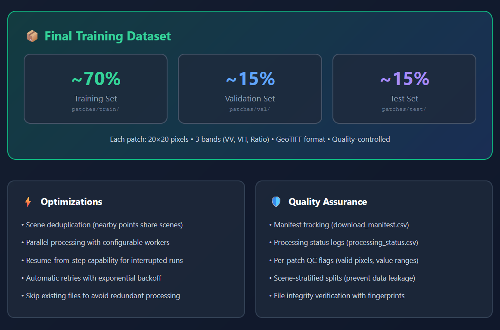

# 🛰️ Hydrosafe Leak Data Preprocessing Pipeline

**HYS Leak Data Preprocessing** is a geospatial data engineering project designed to automate the end-to-end preprocessing of Sentinel-1 SAR imagery for underground water leak detection.  
The pipeline leverages ESA SNAP’s Graph Processing Tool (GPT) inside Docker containers to transform raw `.SAFE` scenes into georeferenced, analysis-ready `.tif` datasets — ready for downstream machine learning and geospatial analytics workflows.

---

## 🌍 Project Overview

Municipal water utilities and infrastructure companies often rely on ground inspections to detect leaks in underground pipelines.  
This project aims to complement those efforts by **building a large-scale Sentinel-1 preprocessing pipeline** that aligns satellite radar data with **known leak events** — enabling the creation of training datasets for predictive leak detection models.

Key capabilities include:

- ✅ Automated ingestion of Sentinel-1 `.SAFE` scenes  
- ✅ Standardized preprocessing (orbit correction, calibration, speckle filtering, terrain correction)  
- ✅ Scene clipping based on geospatial leak locations  
- ✅ Batch generation of **positive** (leak) and **negative** (non-leak) samples  
- ✅ Cloud-ready and containerized for scalable deployments  

---

## 🧭 Project Workflow

The pipeline will eventually automate the following stages:

---

### 1. **Data Ingestion**  
- Read `.SAFE` Sentinel-1 scenes from local storage or an external archive.  
- Scenes are typically shared across multiple ground points within the same region.  



---

### 2. **Preprocessing with SNAP GPT**  
- Apply orbit files  
- Remove thermal noise  
- Calibrate backscatter intensity  
- Apply speckle filtering  
- Perform terrain correction  
- Export as a georeferenced `.tif`  



---

### 3. **Clipping Based on Ground Truth**  
- Read a dataset of known leak points from an Excel sheet (4,200+ points from 2022–2024 in Mexico).  
- Clip the preprocessed scene using a coordinate buffer around each leak location (positive samples).  
- Generate random background samples from non-leak areas for negative training data.  



---

### 4. **Batch Processing & Scaling**  
- Parallelize the workflow for thousands of scenes.  
- Deploy on a cloud VM or container orchestrator for large-scale processing.  










---

## 📊 Example Use Case

- **Input:**  
  - Sentinel-1 `.SAFE` scene (`S1A_IW_GRDH_1SDV_20250826T005018_20250826T005043_060700_078DB4_E255.SAFE`)  
  - Leak dataset (`leaks.xlsx` with location, detection date, fix date)

- **Output:**  
  - Preprocessed `.tif` image ready for analysis  
  - Cropped SAR tiles for each leak point (positive samples)  
  - Random non-leak tiles (negative samples)

During initial testing, a single scene preprocessing run on a local machine (RAM + CPU) completed successfully in **~15 minutes**, producing a fully terrain-corrected `.tif`.

---

## 🐳 Dockerized Processing

The entire pipeline runs inside Docker using ESA SNAP’s GPT. This ensures portability, reproducibility, and easy scaling.

### 🧪 Quick Test Run (Manual)

```bash
docker run --rm -v "$(pwd):/data" mundialis/esa-snap \
  gpt /data/graphs/graph.xml \
  -Pinput="/data/s1_inputs/<SCENE>.SAFE/manifest.safe" \
  -Poutput="/data/s1_outputs/<SCENE>_preprocessed.tif"
````

This command:

* Mounts your project directory to `/data` inside the container
* Executes the SNAP processing graph defined in `graphs/graph.xml`
* Outputs a georeferenced `.tif` into `s1_outputs/`

---

## 🧱 Project Structure

```
hys_leak_data_preprocessing/
├─ docker/                     # Dockerfiles for dev, staging, prod
│  ├─ Dockerfile.dev
│  ├─ Dockerfile.staging
│  └─ Dockerfile.prod
│
├─ graphs/                     # SNAP GPT XML graphs
│  └─ graph.xml
│
├─ scripts/                    # Automation scripts (optional)
│  ├─ run_single_scene.sh
│  └─ batch_preprocess.sh
│
├─ s1_inputs/                  # Raw Sentinel-1 .SAFE scenes (ignored in Git)
├─ s1_outputs/                 # Preprocessed GeoTIFF outputs (ignored in Git)
│
├─ README.md
├─ .gitignore
└─ requirements.txt
```

---

## ☁️ Production Deployment Roadmap

For large-scale execution (4,200+ points over multiple years), the project will be deployed on cloud infrastructure:

* 🛠️ **Development:** Local builds with small sample data
* 🚀 **Staging:** Batch tests on mid-sized datasets with cloud VM
* ☁️ **Production:** Automated pipeline on cloud (e.g., GCP, AWS, or Azure) with parallel scene processing and orchestration (Kubernetes / Airflow)

---

## 🧠 Future Enhancements

* Integration with ASF API for automatic Sentinel-1 scene search & download
* Parallelized batch preprocessing using multi-container or Dask
* Automated feature extraction from SAR time series
* Machine learning model integration for leak prediction

---

## 📚 References

* [ESA SNAP Documentation](http://step.esa.int/main/doc/)
* [Sentinel-1 User Guide](https://sentinel.esa.int/web/sentinel/user-guides/sentinel-1-sar)
* [ASF DAAC](https://asf.alaska.edu/)

---

## 👨‍💻 Authors & Contributors

Developed by the **HYS Leak Detection Engineering Team**
Special thanks to all contributors working on geospatial analytics, SAR processing, and ML integration.

---

> ⚠️ **Disclaimer:** This project is in active development. It is intended for research and engineering purposes and not for direct operational use without validation.


